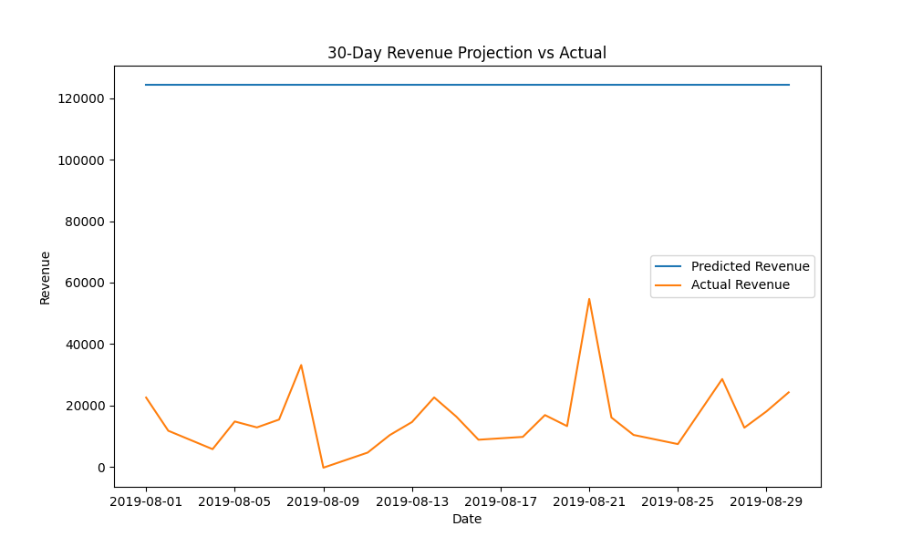
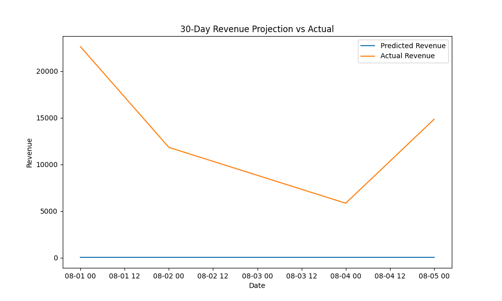
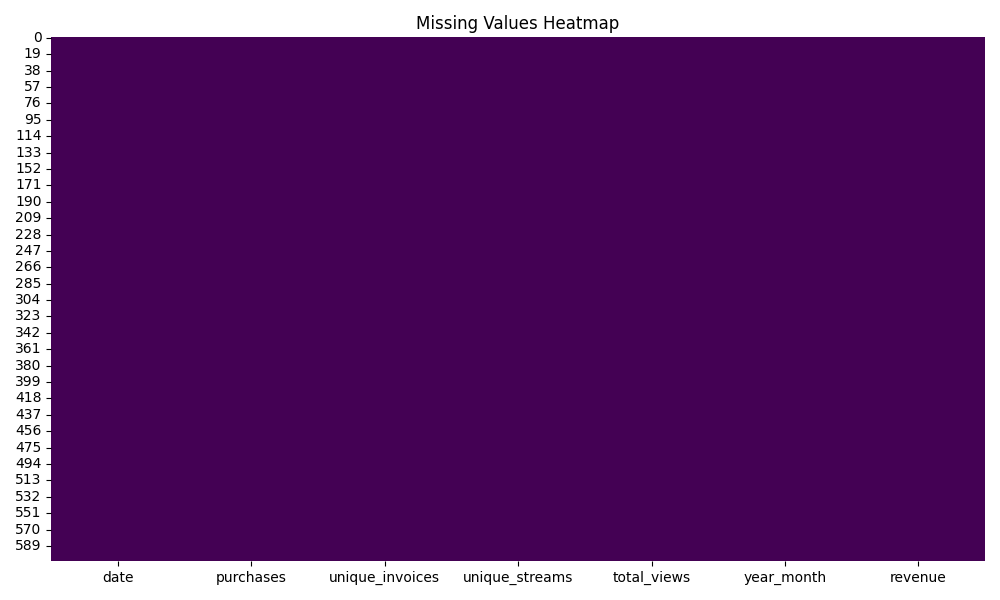
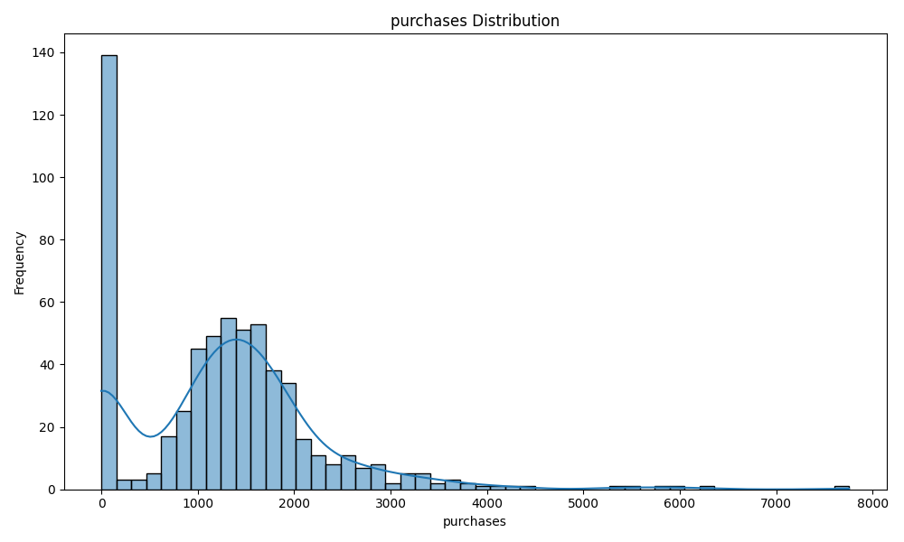
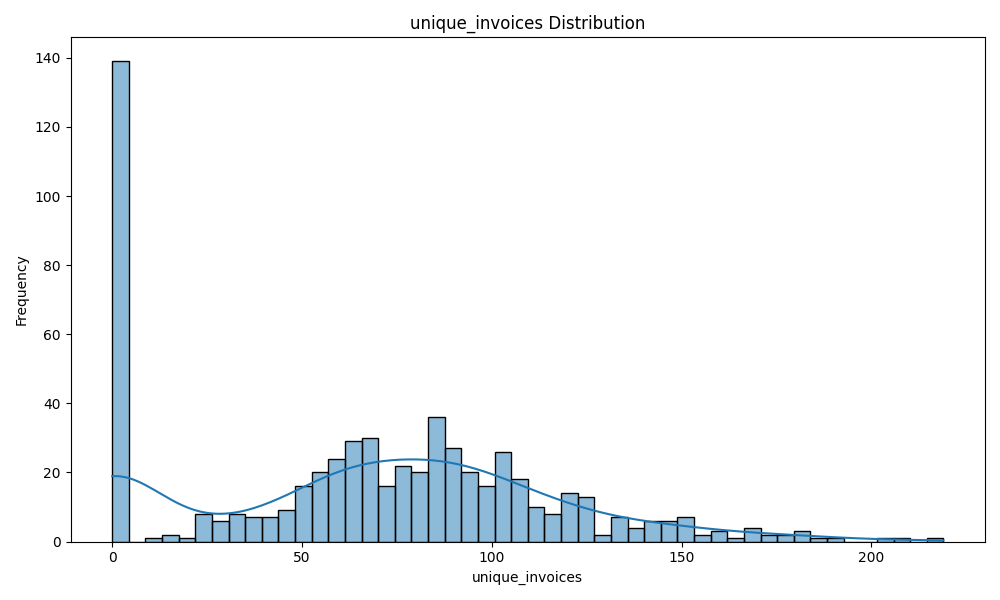
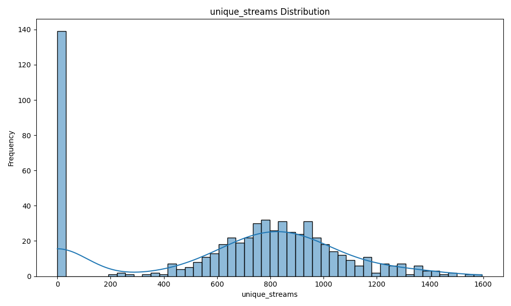
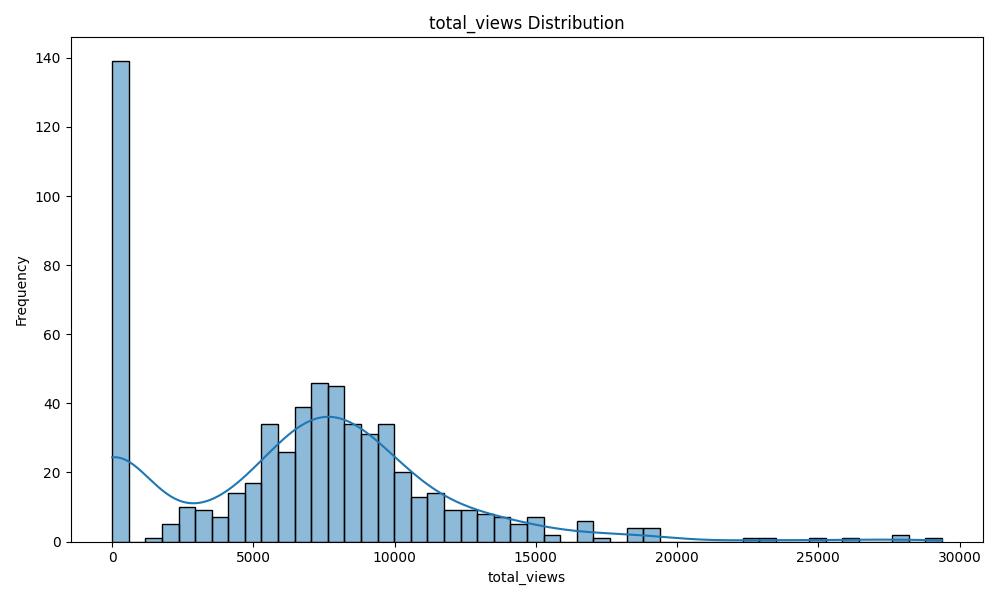
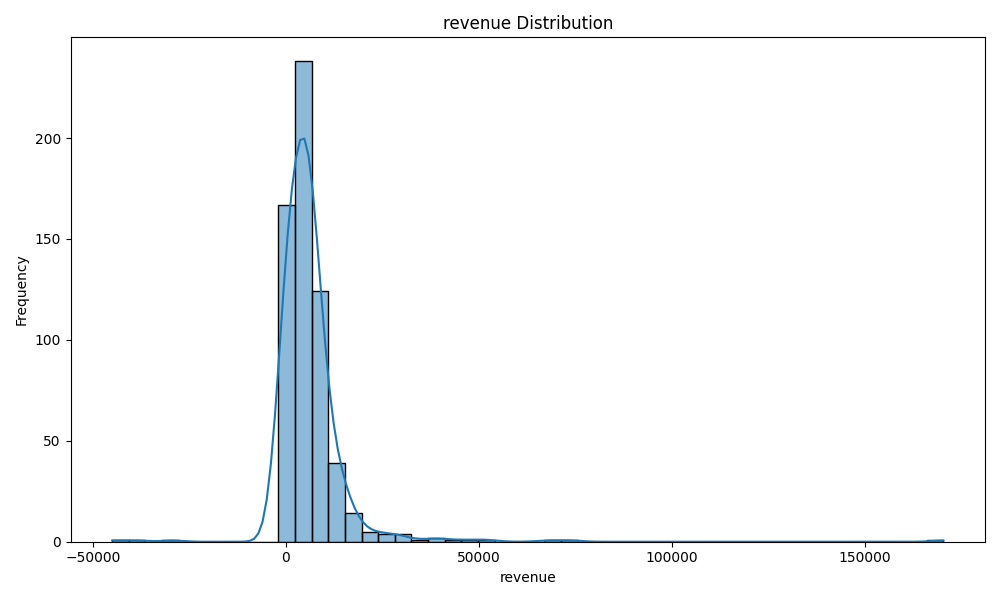

## THIS IS THE FINAL DELIVERY DOCUEMNT OF [ASSIGNMENT](ASSIGNMENT.md)

## CHECKLIST:
- Are there unit tests for the API?
  - Yes, [Unit Test Script](scripts/test_api.py)
- Are there unit tests for the model?
  -  Yes, [Unit Test Script](scripts/test_api.py)

- Are there unit tests for the logging?
  - Yes, [Unit Test Script](scripts/test_api.py)

- Can all of the unit tests be run with a single script and do all of the unit tests pass?
  - Yes, [Unit Test Script](scripts/test_api.py)

- Is there a mechanism to monitor performance?
  - Yes, [Unit Test Script](scripts/test_api.py)

- Was there an attempt to isolate the read/write unit tests from production models and logs?
  - Yes, [Unit Test Script](scripts/test_api.py)

- Does the API work as expected? For example, can you get predictions for a specific country as well as for all countries combined?
  - Yes, [API Script](scripts/api.py)

- Does the data ingestion exists as a function or script to facilitate automation?
  - Yes, [Data Ingestion Script](scripts/cslib.py)

- Were multiple models compared?
  - Yes, RandomForest and LSTM [Multiple Models Script](scripts/model.py)
  
- Did the EDA investigation use visualizations?
  - Yes, [EDA Script](scripts/exploratory_analysis.py) and [Visualizations](scripts/visualizations)

- Is everything containerized within a working Docker image?
  - Yes, [Dockerfile](Dockerfile) 

- Did they use a visualization to compare their model to the baseline model?
  - Yes
  - Base Model Without Fine tuning
  
  - Finetuned RF model
  
  - Finetuned LSTM model (5 days)
  
  
  ---

### Assimilate the Business Scenario and Articulate Testable Hypotheses

### Business Scenario
AAVAIL, a company that initially launched with a tiered, subscription-based service, has experimented with an à la carte approach to revenue generation, primarily outside the US. This experiment has generated transaction-level purchase data across 38 different countries over a couple of years. Management is considering switching to the à la carte model but faces challenges in predicting monthly revenue. They have requested a service that can predict the revenue for the following month and provide projections for specific countries, focusing on the ten countries with the highest revenue.

### Business Opportunity
The primary business opportunity is to create a predictive model that accurately forecasts monthly revenue. This model will help management make informed decisions, stabilize staffing and budget projections, and reduce the time spent on manual revenue predictions.

### Testable Hypotheses

####  **Hypothesis**: Revenue trends can be accurately predicted using transaction-level data aggregated by month.
   - Develop a time-series model to predict monthly revenue and evaluate its accuracy.


#### **State the ideal data to address the business opportunity and clarify the rationale for needing specific data.**
   - The `fetch_data` function in `cslib.py` is designed to load and preprocess the transaction-level data, ensuring it is in the correct format for analysis.
   - **cslib.py:**
     ```python
     def fetch_data(data_dir):
     ```


#### **Create a python script to extract relevant data from multiple data sources, automating the process of data ingestion.**
   - The `fetch_ts` function in `cslib.py` automates the process of loading and preprocessing the time-series data from multiple JSON files.
   - **cslib.py:**
     ```python
     def fetch_ts(data_dir, clean=False):
     ```


#### **Investigate the relationship between the relevant data, the target and the business metric.**
   - The `convert_to_ts` function in `cslib.py` converts the transaction-level data into a time-series format, which can then be used for exploratory data analysis (EDA) and modeling.
   - **cslib.py:**
     ```python
     def convert_to_ts(df_orig, country=None):
     ```


#### **Articulate your findings using a deliverable with visualizations.**

[Exploratory Analysis Script](scripts/exploratory_analysis.py)

#### Results
- **Date:**
  - **Count:** 607 unique dates
  - **Top:** 2017-11-01 (appears once)

- **Purchases:**
  - **Count:** 607
  - **Mean:** 1273.46
  - **Standard Deviation:** 1015.76
  - **Min:** 0
  - **25th Percentile:** 634.50
  - **Median (50th Percentile):** 1293.00
  - **75th Percentile:** 1752.50
  - **Max:** 7756.00

- **Unique Invoices:**
  - **Count:** 607
  - **Mean:** 66.92
  - **Standard Deviation:** 47.87
  - **Min:** 0
  - **25th Percentile:** 27.00
  - **Median (50th Percentile):** 70.00
  - **75th Percentile:** 98.00
  - **Max:** 219.00

- **Total Views:**
  - **Count:** 607
  - **Mean:** 6651.26
  - **Standard Deviation:** 4990.64
  - **Min:** 0
  - **25th Percentile:** 2681.50
  - **Median (50th Percentile):** 7080.00
  - **75th Percentile:** 9368.00
  - **Max:** 29374.00

- **Year-Month:**
  - **Count:** 607
  - **Unique:** 20
  - **Top:** 2018-12 (appears 31 times)

- **Revenue:**
  - **Count:** 607
  - **Mean:** 6131.70
  - **Standard Deviation:** 10395.05
  - **Min:** -44990.05
  - **25th Percentile:** 1805.78
  - **Median (50th Percentile):** 4778.02
  - **75th Percentile:** 7640.24
  - **Max:** 170304.18


#### Insights and Summary

1. **Missing Values Heatmap:**
   - The missing values heatmap indicates that there are no missing values in the dataset. This ensures that the data is complete and ready for analysis without the need for imputation or removal of missing entries.
  

2. **Purchases Distribution:**
   - The distribution of purchases shows a right-skewed pattern, with most days having a low number of purchases and a few days with very high purchases. This suggests that high purchase days are less frequent but significant.


3. **Unique Invoices Distribution:**
   - The unique invoices distribution also exhibits a right-skewed pattern, similar to purchases. This indicates that on most days, the number of unique invoices is low, with occasional spikes.

1. **Unique Streams Distribution:**
   - The distribution of unique streams follows a similar right-skewed pattern, suggesting that the number of unique streams is generally low, with occasional high activity days.

1. **Total Views Distribution:**
   - The total views distribution shows a wide range of values, with a significant number of days having low views and a few days with very high views. This variability indicates fluctuating customer engagement.

2. **Revenue Distribution:**
   - The revenue distribution is highly right-skewed, with most days having low revenue and a few days with exceptionally high revenue. This suggests that revenue generation is concentrated on a few high-performing days, which could be due to promotions, sales events, or other factors.


**Summary**

The dataset is complete with no missing values, making it suitable for analysis. The distributions of purchases, unique invoices, unique streams, total views, and revenue all exhibit right-skewed patterns, indicating that most days have low activity with occasional high activity days. This variability highlights the importance of identifying the factors driving high activity days to optimize business strategies and improve overall performance.


### **State the different modeling approaches that you will compare to address the business opportunity.**

The use of `RandomForestRegressor` and `GridSearchCV` in the `model.py` script is well-aligned with our hypothesis and findings from the exploratory data analysis (EDA). The `RandomForestRegressor` is a robust ensemble learning method that can handle the variability and complexity in the data, as evidenced by the right-skewed distributions and occasional high activity days observed in the EDA. It can effectively capture non-linear relationships and interactions between features, which is crucial for accurately predicting revenue trends. Additionally, `GridSearchCV` helps in optimizing the model's hyperparameters, ensuring that we achieve the best possible performance. This approach leverages the strengths of ensemble methods and systematic hyperparameter tuning to build a reliable and accurate model for predicting monthly revenue trends, addressing the business opportunity effectively.
   

**Iterate on your suite of possible models by modifying data transformations, pipeline architectures, hyperparameters and other relevant factors.**
- Tried with the default hyperparamerters provided with assignments
and the gap between revenue prediction and actual was big 


- Then changed the hyperparameters

To improve the model's performance and reduce the gap between actual and predicted values, we can consider tuning additional hyperparameters of the `RandomForestRegressor`. hyperparameter tuning:

1. **Number of Trees (`n_estimators`):**
   - Increased the range to `[50, 100, 200]` to explore the impact of more trees.

2. **Maximum Depth of Trees (`max_depth`):**
   - Added `[10, 20, 30, None]` to control the depth and prevent overfitting.

3. **Minimum Samples per Split (`min_samples_split`):**
   - Added `[2, 5, 10]` to control the minimum number of samples required to split an internal node.

4. **Minimum Samples per Leaf (`min_samples_leaf`):**
   - Added `[1, 2, 4]` to control the minimum number of samples required to be at a leaf node.

5. **Maximum Features (`max_features`):**
   - Added `['auto', 'sqrt', 'log2']` to control the number of features to consider when looking for the best split.
  


## API designed - 
[api.py](scripts/api.py)

### API Endpoints - 
- POST `/train`
- POST `/predict` 
- GET `/logs`
 
## Deployment & Test
Created a [dockerfile](Dockerfile) for deployment and tested APIs with [testclient](scripts/test_api.py))

## Post Product Script

[monitor.py](scripts/monitor.py)

## Articulate your findings in a summary report.

### Summary Report: Revenue Prediction Analysis for United Kingdom

#### Findings

1. **Prediction Consistency:**
   - The `Predictions DataFrame` shows that the model predicts the same revenue value for any date rage of August 2019 and for both models (RF and LSTM). This indicates a lack of variability in the model's predictions, suggesting that the model **might not be capturing the underlying patterns in the data effectively**.

2. **Model Performance:**
   - The large discrepancy between the predicted and actual revenue values indicates that the model is not performing well. The model's inability to predict the variability in revenue suggests that it may be overfitting or underfitting the data.

#### Recommendations

1. **Feature Engineering:**
   - I have not implemented enhanced feature engineering by adding more relevant time-series features, such as moving averages, rolling statistics, and additional lag features. This might help the model capture the underlying patterns in the data more effectively.

3. **Data Quality Improvement:**
   - Need perform more data cleaning to handle missing values, outliers, and inconsistencies. Ensure that the dataset is complete and consistent over time.

4. **Alternative Models:**
   - I have tried RF and LSTM, should consider exploring alternative time-series models, such as ARIMA, SARIMA which might be better suited for capturing the temporal dependencies and variability in the revenue data.

#### Conclusion

The current model's predictions for revenue in the United Kingdom show a significant gap compared to the actual revenue values, indicating poor model performance. By addressing data quality issues, implementing hyperparameter tuning, enhancing feature engineering, and exploring alternative models, we can improve the accuracy and reliability of the revenue predictions. These steps will help in better addressing the business opportunity and providing more actionable insights for decision-making.

---
